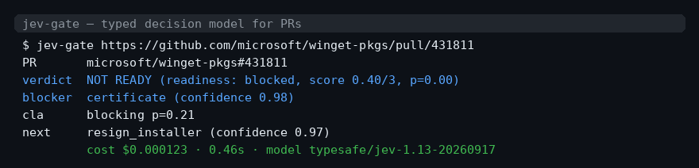

# jev-gate

Triage any GitHub PR in under a second for ~$0.0001 — a typed decision model judge for PRs, not a chatbot reviewer.



```
$ jev-gate https://github.com/microsoft/winget-pkgs/pull/431811
PR       microsoft/winget-pkgs#431811
verdict  NOT READY (readiness: blocked, score 0.41/3, p=0.02)
blocker  certificate (confidence 0.99)
cla      blocking p=0.05
next     resign_installer (confidence 0.98)
         cost $0.000143 · 0.58s · model typesafe/jev-1.13
$ echo $?
1
```

An LLM code review of the same PR costs $0.01–0.05 and takes 5–90 seconds, then you still have to parse prose into a decision. `jev-gate` asks a decision model five typed questions and gets typed answers back: a probability, a classified blocker from a fixed set, a readiness score, and a next action. Nothing to parse. Nothing to prompt-engineer into stability.

## Install

Zero dependencies — Python 3.9+ stdlib only.

```sh
curl -fsSL https://raw.githubusercontent.com/ruslanlap/jev-gate/main/jev_gate.py -o ~/.local/bin/jev-gate
chmod +x ~/.local/bin/jev-gate
export OPENROUTER_API_KEY=sk-or-...   # https://openrouter.ai/keys
```

Or with pipx:

```sh
pipx install git+https://github.com/ruslanlap/jev-gate
```

Unauthenticated GitHub API works (60 req/h); set `GH_TOKEN` for more.

## GitHub Action

Post a verdict comment and apply `jev:blocked` / `jev:ready` labels on every opened PR:

```yaml
on: [pull_request_target]
jobs:
  triage:
    runs-on: ubuntu-latest
    steps:
      - uses: ruslanlap/jev-gate@main
        with:
          openrouter-api-key: ${{ secrets.OPENROUTER_API_KEY }}
```

One secret, no checkout, ~1s and ~$0.0001 per PR. CLI forms: `--markdown <url>` (one-line verdict for comments/CI) and `--batch <url>...` (sorted table for backlogs).

## How it works

```
PR URL ──▶ GitHub REST ──▶ compact timeline ──▶ ONE decisions call ──▶ validate ──▶ verdict
            3 requests      (events, not diff)    5 typed questions     (strict)     + exit code
```

One request, five typed questions (speculative fan-out — dependent decisions resolved in a single round trip):

| question | type | returns |
|---|---|---|
| `merge_ready` | noul | probability the PR is safe to merge now |
| `primary_blocker` | choice | one of `none cla certificate validation changes_requested other` |
| `cla_blocking` | noul | probability an unsigned CLA is blocking |
| `readiness` | score | 0–3 scale: blocked / needs work / nearly ready / merge ready |
| `next_action` | choice | one of `merge wait_ci resign_installer fix_manifest address_review comment close` |

Answers are validated before anything is acted on (`jev_gate.validate`): the choice must be in the declared id set, probability keys must match exactly, all numbers finite in \[0,1], probabilities must sum to 1 within 0.02, and the chosen option must be the argmax. Any violation → hard error, exit code 2. The model never returns executable content — only identifiers from a fixed set fixed in code.

## Why not just ask an LLM

| | LLM review | jev-gate |
|---|---|---|
| cost / PR | $0.01–0.05 | ~$0.0001 (measured $0.000143) |
| latency | 5–90 s | 0.4–0.6 s (measured 0.58 s) |
| output | prose → parse it yourself | typed: ids, probabilities, confidence |
| prompt drift | same prompt, different verdicts | schema-fixed; invalid → refuse to act |
| validation | none | choice∈ids ∧ probs sum 1 ∧ argmax ∧ finite |

The input pricing behind the numbers: $0.042/M input tokens, $0/M output tokens (decisions are tiny). A 3.4K-token PR timeline costs $0.00014.

## Evidence: PR microsoft/winget-pkgs#431811

Real PR, real timeline (moderator confirmed the untrusted certificate was the only blocker; CLA signed later; `CHANGES_REQUESTED` review stands). Fixture in `tests/`, live capture 2026-09-21:

| question | Jev answer | expected | match |
|---|---|---|---|
| primary_blocker | `certificate`, confidence 0.99 | `certificate` (conf ~0.99) | ✓ |
| merge_ready | 0.02 | ~0.02 | ✓ |
| cla_blocking | 0.22 | ~0.05 | ~ (right answer, wider margin) |
| readiness | 0.41/3 | ~0.2/3 | ✓ |
| next_action | `resign_installer`, confidence 0.96 | `resign_installer` (conf ~0.98) | ✓ |

```sh
$ jev-gate --self-check   # offline validation sanity check
self-check OK
```

## Benchmark

39 closed PRs from 4 public repos (winget-pkgs, cpython, next.js, CmdPal-Definition), ground truth = merged/closed-unmerged, model saw a pre-final timeline snapshot only (state scrubbed to `open`, events after cutoff removed — no leakage). Full methodology and data: [docs/benchmark.md](docs/benchmark.md), [docs/benchmark-data.json](docs/benchmark-data.json).

| metric | value |
|---|---|
| accuracy (ready vs blocked) | 16/39 = 41.0% |
| baseline (always "blocked") | 22/39 = 56.4% |
| precision / recall (ready) | 100% (3/3) / 11.5% (3/26) |
| confusion (TP/FP/TN/FN) | 3 / 0 / 13 / 23 |
| mean confidence correct vs wrong | 0.88 vs 0.79 |
| latency p50 / p90 | 0.38 s / 0.47 s |
| cost | $0.000055 per PR |

Interpretation: read as a readiness **predictor** on pre-final snapshots, the tool fails (41% < always-blocked baseline 56%). Read as a **gate**, the profile is the useful half: FP = 0 — it never once green-lit a rejected PR. Several FN are correct statements about the snapshot moment (a standing `changes_requested` review, merged only days later). Use it as a cheap "anything visibly blocking right now" check, not a merge oracle. Limits of this evidence: n=39 (±15 pp CI), label = final state not a moderator diagnosis, mixed sample. Full honesty section in [docs/benchmark.md](docs/benchmark.md).

## License

MIT
